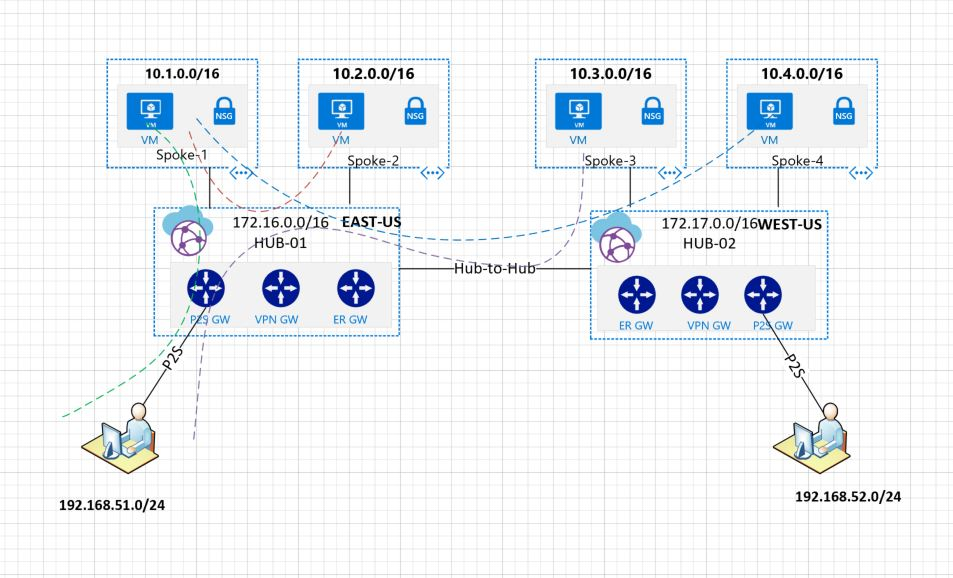

# Build Azure vWAN service using Terraform


## Architecture diagram



## Getting Started


This code sample will build the above architecture

### Prerequisites

```
git
terraform
```

### Installing

git clone the repository and run the following commands

```
# setup
terraform init
terraform plan
terraform apply
# to cleanup
terraform destroy
```

## Running the tests

End Users need to

- Install the mydomain.com.pfx certificate in the local certificate store.
- Download and install the VPN Client from Azure Portal

After the p2s client is connected:
ipconfig (should get an ip from the P2S subnets 192.168.51.0/24 or 192.168.52.0.24)

```
ping 10.1.1.4
ping 10.2.1.4
ping 10.3.1.4
ping 10.4.1.4
```


## Contributors

Many thanks to Shaun Croucher for his contributions.


## Acknowledgments