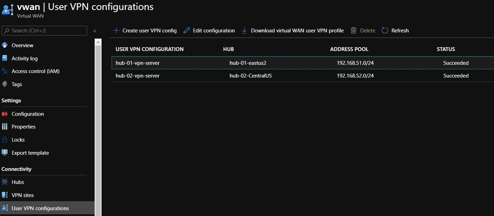

# Build Azure vWAN using Terraform


## Architecture diagram


## Getting Started


This code sample will build the above architecture. Detailed blog post here.
[Nehali Neogi Blog - Azure Virtual WAN using terraform - URL](https://nehalineogi.blogspot.com/2020/06/Azure-Virtual-WAN-using-Terraform.html)

### Prerequisites

```
git
terraform
```

### Installing

git clone the repository and run the following commands

```
# setup
terraform init
terraform plan
terraform apply  (run this command twice if you run into dependency issue)
# to cleanup
terraform destroy (run this command twice if you run into dependency issue)
```

## Running the tests


> [!NOTE]End Users need to follow the following steps:


1. Make sure that the following certificates are in the correct location:

- mydomain.com.pfx	Current User\Personal\Certificates
- rootCA.crt	Local Computer\Trusted Root Certification Authorities


2.  Download and install the VPN Client from Azure Portal.
 

3. After the p2s client is connected:
ipconfig (should get an ip from the P2S subnets 192.168.51.0/24 or 192.168.52.0.24)


```
ping 10.1.1.4
ping 10.2.1.4
ping 10.3.1.4
ping 10.4.1.4
```


## Contributors

Many thanks to Shaun Croucher for his contributions.


## Acknowledgments